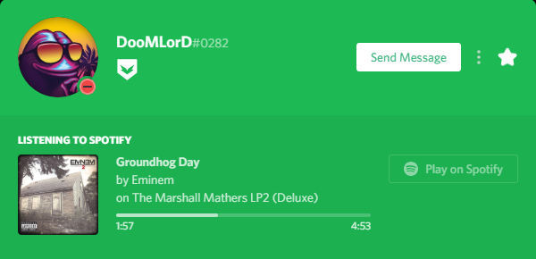

# Що таке розширена присутність?

**Що таке розширена присутність і як це працює?**

Розширена присутність є однією з найкрутіших особливостей Discord на даний момент, це в основному змінює зовнішній вигляд і стиль вашої "тепер граючої" області у вашому профілі Discord. Ігри, що підтримують розширену присутність від Discord \(наприклад, GTA V ™, Rainbow Six® Siege тощо\), дуже цікаво передають ваш статус у грі на ваш профіль Discord. Вони в основному використовують свою програму, щоб надіслати ваш статус гри Discord, який відображає інформацію як насичене присутність у вашому профілі. Нарешті, вони стають способом на малюнку нижче.

