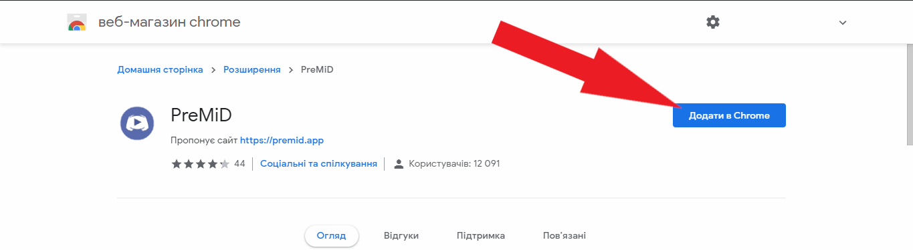

# Розширення


 Ви повинні встановити розширення **та** застосунок, щоб все працювало правильно!


### Розширення

Установка розширення - найпростіша частина! Отже, просто натисніть на ім’я вашого браузера і дотримуйтесь інструкцій.




Firefox видалив наше розширення з магазину додатків. Не хвилюйтесь, ми спробуємо відновити його з мертвих, оскільки плануємо завантажувати його на наші власні сервери в наступному оновлення! Зараз ви можете або зачекати, або дотримуватися наведених нижче вказівок.


1. Перейдіть на [вкладку випусків](https://github.com/PreMiD/PreMiD/releases)
2. Завантажте [premid-1.3.1.2-fx.xpi](https://github.com/PreMiD/PreMiD/releases)
3. Перейдіть до `about:addons`
4. Клацніть на маленькому символі шестерні у верхньому правому куті
5. Виберіть **"Установити доповнення з файлу"**
6. Виберіть недавно завантажений файл
7. Прийміть установку, натиснувши на **"Додати"**
8. Установіть [застосунок](application.md), якщо Ви ще не встановили



1. Перейдіть на [сторінку в магазині](https://chrome.google.com/webstore/detail/premid/agjnjboanicjcpenljmaaigopkgdnihi?authuser=0&hl=en)
2. Натисніть на **"Додати в Chrome"**
3. Установіть [застосунок](application.md), якщо Ви це не зробили ще 




1. Установіть розширення під назвою **"**[**Install Chrome Extensions**](https://addons.opera.com/en/extensions/details/install-chrome-extensions/)**"**
2. Тепер установіть [PreMiD розширення](https://chrome.google.com/webstore/detail/premid/agjnjboanicjcpenljmaaigopkgdnihi)
3. Установіть [застосунок](application.md), якщо Ви це ще не зробили



