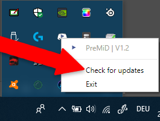
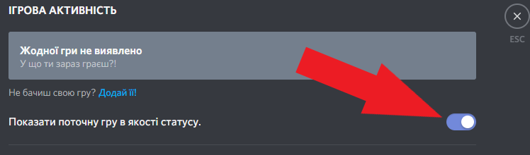
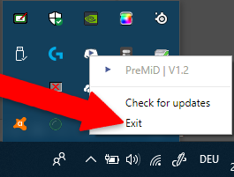

# Вирішення проблем

## Перш за все

Переконайтесь, що [розширення](../installation/extension.md) **і** [застосунок встановлені](../installation/application.md)!  
Ви також можете спробувати різні кроки. Вам не доведеться пробувати їх у тому порядку, коли ми їх розмістили тут.

## Discord не показує присутність

### Будьте певними, що Discord НЕ запущено за правами адміністратора

Це дуже важливо. Розширена присутність Discord не буде працювати, якщо Ви запустили Discord з правами адміністратора.

### Перевірте, чи на вашому комп’ютері працює антивірус або брандмауер

Іноді **антивіруси** та **брандмауери блокують додатки**, які створюють/розміщують сервери або просто підключаються до Інтернету. Ми використовуємо **локальний сервер** для **отримання** та **передачі** даних між нашим додатком та розширенням, тому якщо ви **заблокуєте** можливість програми передавати дані, ви, ймовірно, **не зможете** використовувати **PreMiD**.

Ви можете дізнатися більше про відключення антивірусу та брандмауера у **Google**, якщо хочете **виправити** свою проблему.

### Переконайтеся, що ви встановили останню версію PreMiD

Ви можете перевірити це, натиснувши правою кнопкою миші кнопку "Check for updates" на значку PreMiD на панелі завдань. Інакше застосунок повідомить вас, коли з’явиться нове оновлення. І не потрібно турбуватися про розширення, оскільки воно оновлюється автоматично.


Версії розробників та самопобудовані версії не оновляться автоматично


### Будьте впевненими, що ви увімкнули розширену присутність Discord у налаштуваннях

 

### Перезавантажте сторінку

Ви можете натиснути **Strg+R**/**F5** чи **CMD+R** на клавіатурі, замість того,  щоб шукати кнопку оновлення.

### Перезавантажте браузер

**Alt+F4** робить гарну роботу теж. \(Очевидно, вам доведеться запустити веб-переглядач знову\)

### Вимкніть розширення

Вимкніть всі ваші доповнення і подивіться, чи працює він знову. Якщо так, спробуйте ввімкнути крок за кроком свої додатки та скажіть нам, яке розширення зламало PreMiD.

### Перезавантажте PreMiD \(Застосунок\)

Ви повинні перезавантажити PreMiD далі.

### Перезавантажте Discord

Натисніть **Strg+R** чи **CMD+R** на клавіатурі або перезавантажте Discord вручну.

### Перезавантажте комп’ютера

Сподіваюся, ви знаєте, як перезапустити комп’ютер.

### Перевстановіть PreMiD

Іноді з файлами щось не так ... Посібники для встановлення можна знайти [тут](../installation/application.md).

### Ручне видалення



1. Перейдіть до `C:\Users\USER\AppData\Local`і видаліть теку`premid`
2.  Перейдіть до`C:\Users\USER\AppData\Roaming` і видаліть теку`PreMiD`



Перейдіть до `ВАШДИСК:/users/USER/~Library/Application Support` і видаліть теку `PreMiD`



Згадайте роль staff на нашому [Discord сервері](https://discord.gg/WvfVZ8T), якщо жоден із цих кроків не допоміг.

## Це не вирішило моєї проблеми

Ви можете:

* [Відкрити issue](https://github.com/PreMiD/PreMiD/issues/new/choose) на [GitHub](https://github.com/PreMiD/PreMiD)
* Запитати співробітника \(має роль Staff\) у [\#support](https://discord.gg/WvfVZ8T)

  

